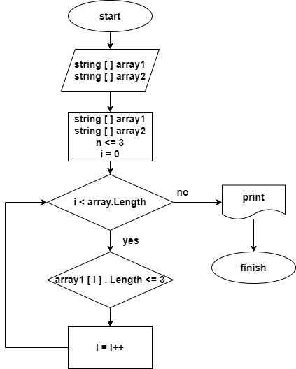

# Описание блок-схемы.

## На изображении представлена схема алгоритма, которая иллюстрирует процесс обработки двумерного массива строк с целью определения самой длинной строки. 

### На схеме присутствуют следующие обозначения:

* start: начало процесса.
* string [n] array1: входной массив строк.
* string [n] array2: выходной массив строк.
* string [n<=3] i=o: проверка условий нахождения строки.
* i < array.length: проверка условия, когда длина строки становится меньше трех символов.
* no: значение, присваиваемое переменной, если условие не выполняется.
* yes: значение, присваиваемое переменной, если условие выполняется.
* print: печать строки.
* finish: завершение процесса.

### Также на схеме присутствует блок с меткой "<array1[i].length <= 3", который показывает условие, при котором строка может быть добавлена в выходной массив. Стрелки указывают направление выполнения алгоритма.